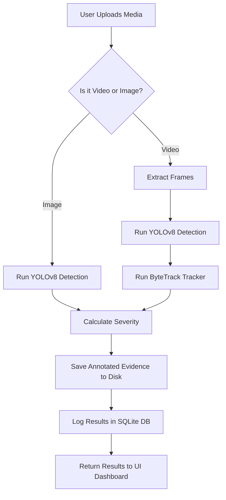
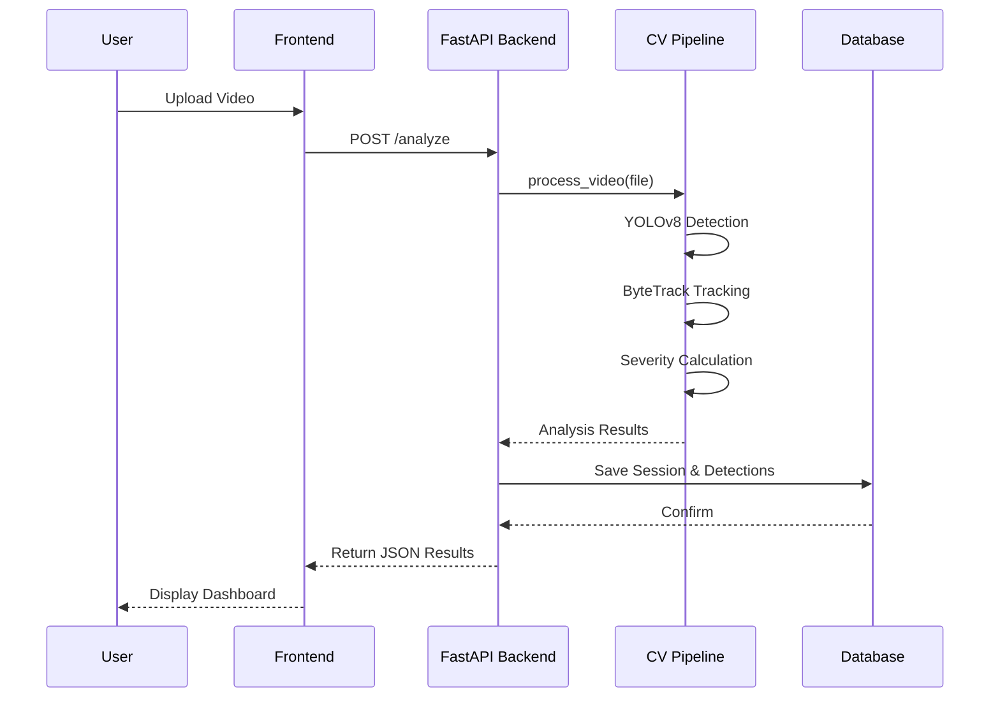
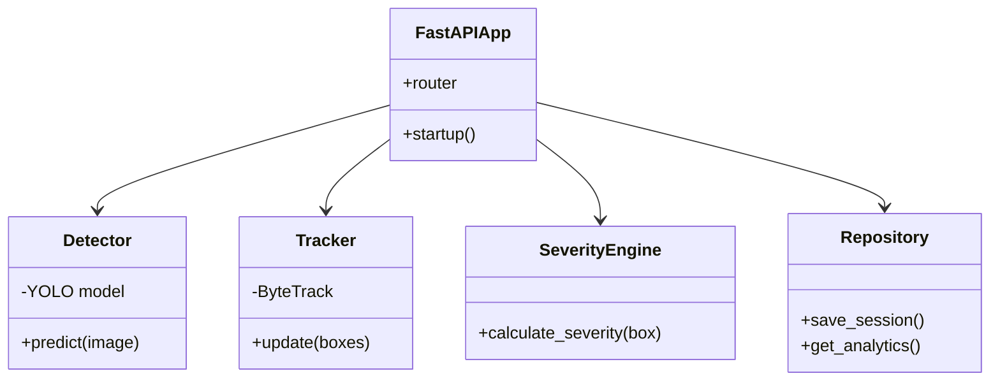
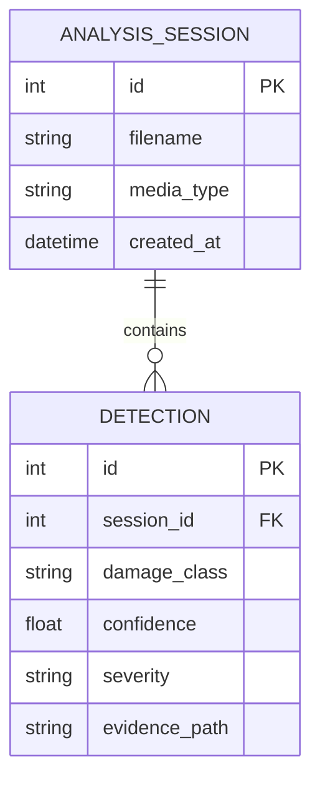
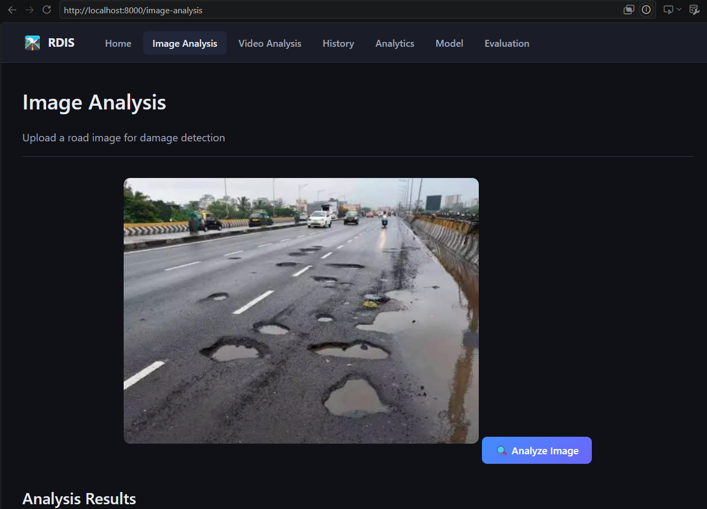
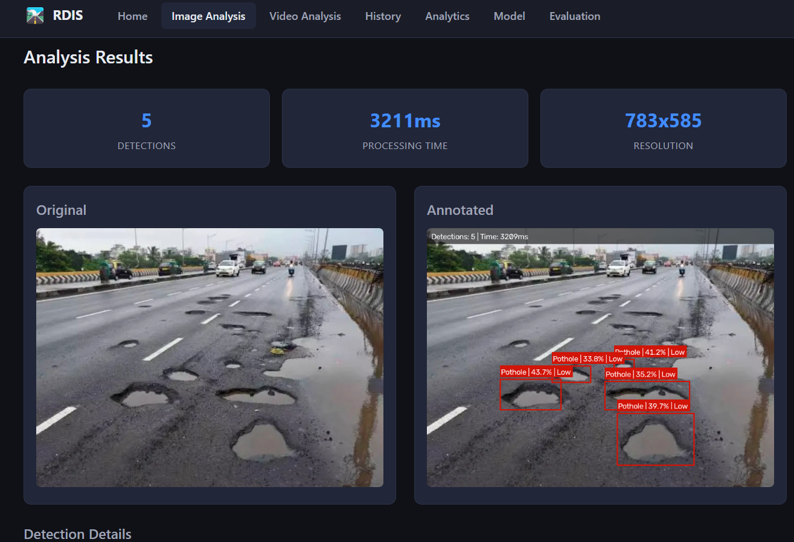
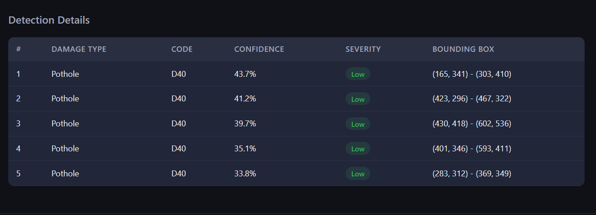

# 1. Cover Page

**Project Title:** Road Damage Intelligence System  
**Course / Evaluation:** VITyarthi "Build Your Own Project"  
**Domain:** Computer Vision & AI Applications  
**Date:** September 2026  

---

## 2. Introduction

Road maintenance is a critical component of civil infrastructure management. Traditional road inspection relies heavily on manual surveys, which are time-consuming, expensive, and subject to human error. This project presents the **Road Damage Intelligence System**, an automated computer vision application designed to detect, classify, and estimate the visual severity of road damages from images and video feeds. Utilizing state-of-the-art deep learning object detection (YOLOv8) combined with multi-object tracking (ByteTrack), the system provides a robust, modular, and scalable solution. A fully functional web interface allows users to upload media, view annotated evidence, and analyze historical detection data through an interactive dashboard.

---

## 3. Problem Statement

Road damage, such as potholes and cracks, poses significant safety hazards to vehicles and pedestrians. The primary challenge is to automate the detection process to make it objective and scalable. 

**Objectives:**
1. **Automated Detection**: Accurately detect road damages in both static images and video streams.
2. **Classification**: Categorize the damage into standard RDD2022 dataset classes (`D00`: Longitudinal Crack, `D10`: Transverse Crack, `D20`: Alligator Crack, `D40`: Pothole).
3. **Severity Estimation**: Heuristically estimate the visual severity of the damage (Low, Medium, High).
4. **Analytics & Persistence**: Store detection history and generate analytics to help prioritize maintenance.

---

## 4. Functional Requirements

1. **User Media Processing**: The system must allow users to upload images and videos for automated inspection.
2. **Detection & Classification**: The system must run a YOLOv8 object detection model to identify and classify road damage.
3. **Video Tracking**: The system must track identified damages across video frames to prevent duplicate logging.
4. **Severity Engine**: The system must assign a severity score to each damage instance based on visual bounding box heuristics.
5. **Analytics & History**: The system must store all analysis sessions in a database and provide a dashboard with data visualization (Plotly charts).

---

## 5. Non-functional Requirements

1. **Performance**: Video processing must process frames efficiently by skipping frames when necessary to maintain near real-time throughput.
2. **Usability**: The frontend must be accessible via a standard web browser without requiring the user to install any specialized software or write code.
3. **Maintainability**: The codebase must be highly modular, abstracting database interactions (Repository Pattern) and computer vision logic into separate components.
4. **Reliability & Error Handling**: The system must gracefully handle incorrect file formats, excessively large files, and missing model weights by returning standard HTTP 5xx or 4xx errors instead of crashing.
5. **Testing**: The system must be backed by a comprehensive unit and integration test suite to prevent regressions.

---

## 6. System Architecture

The application is built with an inference-first architecture that separates concerns across multiple layers:

- **Frontend**: A responsive web dashboard (HTML, CSS, JS, Jinja2).
- **Backend API**: A RESTful API built with FastAPI.
- **Computer Vision Pipeline**: OpenCV for I/O, YOLOv8 for detection, ByteTrack for tracking.
- **Database**: SQLite with SQLAlchemy ORM.


---

## 7. Design Diagrams

### 7.1 Use Case Diagram
```mermaid
usecaseDiagram
    actor User as "Civil Engineer / User"
    
    usecase U1 as "Upload Image/Video"
    usecase U2 as "View Detection Results"
    usecase U3 as "View Analytics Dashboard"
    usecase U4 as "Review Saved Evidence"
    
    User --> U1
    User --> U2
    User --> U3
    User --> U4
```

### 7.2 Process Flow / Workflow Diagram


### 7.3 Sequence Diagram


### 7.4 Class / Component Diagram


### 7.5 ER Diagram


---

## 8. Design Decisions & Rationale

1. **Object Detection (YOLO) vs. Segmentation**: Object detection was chosen over image classification or semantic segmentation because it perfectly balances the need to localize multiple individual damages with real-time inference speeds.
2. **Visual Severity vs. Physical Severity**: Without camera calibration, true physical dimensions cannot be calculated from 2D images. Therefore, the system transparently utilizes a *visual* severity heuristic based on the proportional area of the damage in the image.
3. **ByteTrack for Video Processing**: Instead of using heavy Re-ID models like DeepSORT, ByteTrack was selected because it leverages the existing detection bounding boxes and confidence scores, providing high-speed tracking with minimal computational overhead.
4. **Repository Pattern**: All database interactions are abstracted behind a Repository class. This prevents database queries from leaking into API route handlers.

---

## 9. Implementation Details

**Dataset & Model Selection:**
The system is built for the **RDD2022 (Road Damage Dataset 2022)**. The underlying model utilizes the **YOLOv8 architecture**, fine-tuned for high precision on four damage classes (D00, D10, D20, D40). YOLOv8 was selected due to its state-of-the-art balance between mAP (Mean Average Precision) and real-time inference speed (FPS).

**Video Processing:**
Videos are processed frame-by-frame using `cv2.VideoCapture`. To maintain performance:
- Frames can be skipped (`FRAME_SKIP` configuration).
- Detected damages are passed to the Tracker.
- An **Evidence Cooldown** mechanism ensures that an annotated snapshot of a tracked damage is only saved to the database once every $N$ frames, preventing database bloat.

---

## 10. Screenshots / Results





## 11. Demo Video
   https://drive.google.com/file/d/1_L_tG02_7kU-PJoV77IHhP0GEGp57yOJ/view?usp=sharing

## 12. Testing Approach

The project includes a comprehensive, automated test suite utilizing `pytest` with 81 passing tests. The testing strategy covers:
- **Unit Tests**: Validating preprocessing functions, severity engine logic, and tracking mechanisms.
- **Integration Tests**: Verifying the database ORM, session management, and API endpoints using FastAPI's `TestClient`.
- **Validation Constraints**: Ensuring strict file extension checks, payload sizes, and proper HTTP error codes.

---

## 13. Challenges Faced

1. **Duplicate Detections in Video**: Initially, running object detection on video frames resulted in the same pothole being logged hundreds of times. This was resolved by integrating ByteTrack to deduplicate IDs across frames.
2. **Database Bloat**: Saving an image for every single detection frame filled up the hard drive instantly. We solved this by implementing an "Evidence Cooldown" that only saves one crop of a specific tracked damage every 30 frames.
3. **Class Mapping Confusion**: Handling custom trained YOLO models that output class indices in varying orders required building a flexible JSON-based mapping system in the `.env` configuration file.

---

## 14. Learnings & Key Takeaways

1. **System Integration**: Building an AI project is much more than just training a model; abstracting the model behind a robust API and ensuring smooth data flow is where the majority of engineering effort goes.
2. **Heuristic Engineering**: Learning to create transparent, non-ML heuristics (like the visual severity engine) to complement deep learning outputs is crucial for building complete products.
3. **Tracker Mechanics**: Gaining a deep understanding of how IoU (Intersection over Union) and Kalman filters work under the hood in modern trackers like ByteTrack.

---

## 15. Future Enhancements

- **Depth Estimation Integration**: Utilizing stereo cameras or LiDAR to calculate exact physical dimensions for highly accurate severity scoring.
- **Mobile Edge Deployment**: Exporting the model to ONNX/TFLite for deployment directly on mobile devices mounted on municipal vehicles.
- **Geospatial Mapping**: Integrating GPS metadata from images/videos to plot road damage clusters on an interactive map.

---

## 16. References

1. Arya, D., et al. (2022). *Global Road Damage Detection: State-of-the-art Solutions*. RDD2022 Challenge.
2. Ultralytics. (2023). *YOLOv8 Documentation*. https://docs.ultralytics.com
3. FastAPI Framework Documentation. https://fastapi.tiangolo.com
4. Zhang, Y., et al. (2022). *ByteTrack: Multi-Object Tracking by Associating Every Detection Box*.
